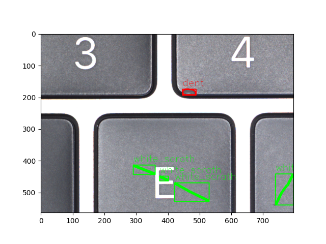

<div align="center">

# Defect Detection based on Zero-Shot Instance Segmentation

</div>

## Description

What it does

## TODO
project 資料夾只寫定義，測試調參在 tests 寫，以 OO 去使用 project 內的 class
* [ ] model implementation
* [ ] training, testing/inference procedure (測試跟訓練調參統一寫在 tests 裡面，看要怎麼規劃流程才比較好做)
* [x] dataset implementation
* [x] prepare word-vectors

## How to run

First, install dependencies

```bash
# clone project
git clone https://github.com/guyleaf/Defect-Detection-ZSI
# or via SSH
git clone git@github.com:guyleaf/Defect-Detection-ZSI.git

# install project
cd Defect-Detection-ZSI
pip install -e .
pip install -r requirements.txt
```
## Dataset Implementation
### Dataset Keycap
Train image num : 218 <br>
Test image num : 46 <br>
#### Option
```bash
self.parser.add_argument('--mode', type=str, default='train', help= 'train or test')
self.parser.add_argument('--data_dir', type=str, default=os.path.join('dataset', 'keycap'), help='dataset folder')
self.parser.add_argument('--output_dir', type=str, default='fk', help='output folder')
self.parser.add_argument('--debug', action='store_true', help='debug mode true or false')
```
#### Run
```bash
python prepare_data.py --mode train --ouput_dir fk 
```
#### Result
```bash
------------ Options -------------
data_dir: dataset\keycap\train_seen
debug: False
mode: train
output_dir: fk\train_seen_json
-------------- End ----------------
save json to  fk\train_seen_json\train.json
```
#### Format
```bash
COCO_dic = {
    "images" : [img_dic0, img_dic1, img_dic2, ...]
    "annotations" : [ann_list0, ann_list1, ann_list2, ...]
    "categories" : [cat_list0, cat_list1, cat_list2, ...]
}
# img_dic
img_dic = {
    "file_name" : str,
    "height" : int,
    "width" : int,
    "id" : int
}
# ann_list
ann_list = [ann_dic0, ann_dic1, ann_dic2, ...]
# ann_dic
ann_dic = {
    "segmentation" : [contours] , #from opencv
    "area" : int ,
    "bbox" : roi , # (x, y, w, h) # from opencv
    "category_id" : int,
    "id" : int
}

```
#### Load *.json and visualization of each image
```bash
self.parser.add_argument('--debug', action='store_true', help='debug mode true or false')

if opt.debug:
    with open(os.path.join(opt.output_dir, opt.mode + '.json')) as f:
        result=json.load(f)
    visualization(coco, opt)
```

